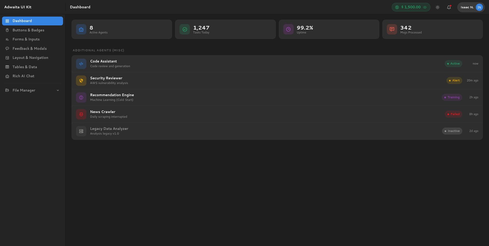
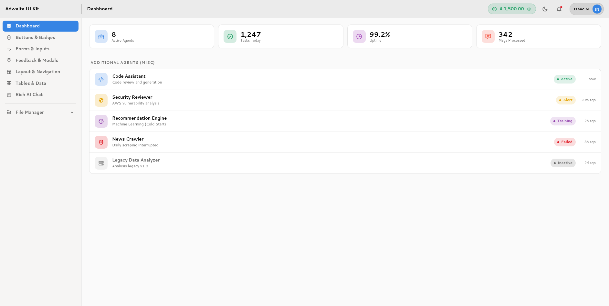
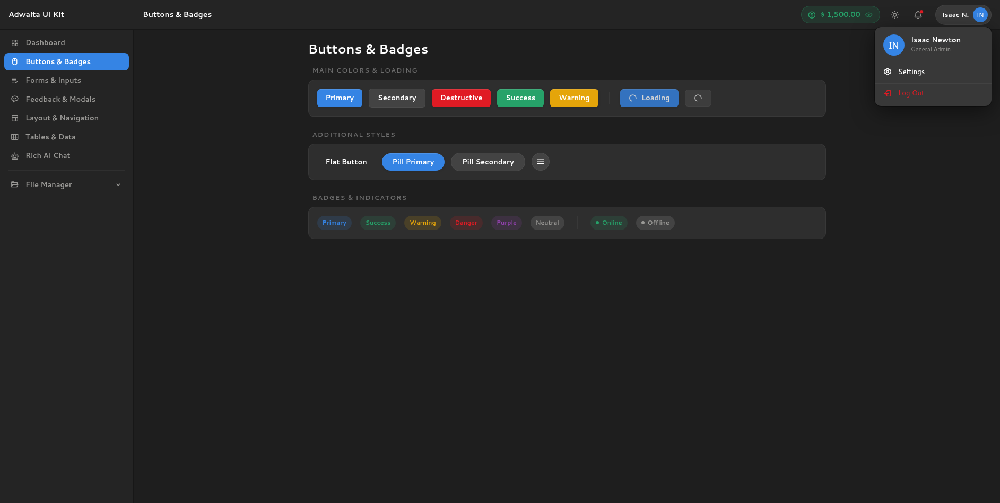
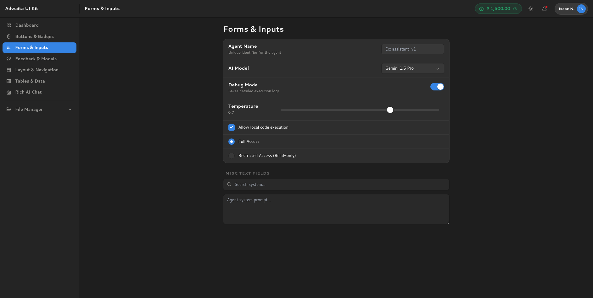
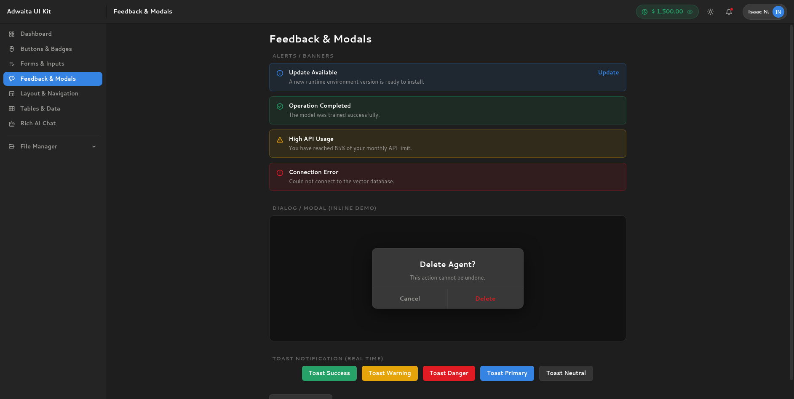
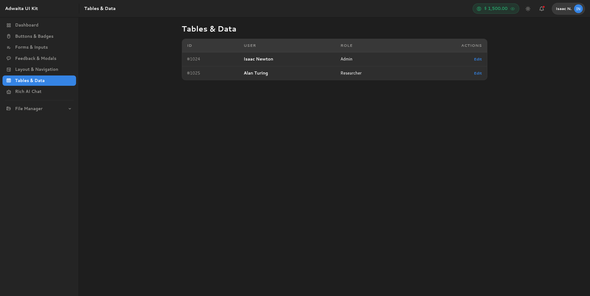
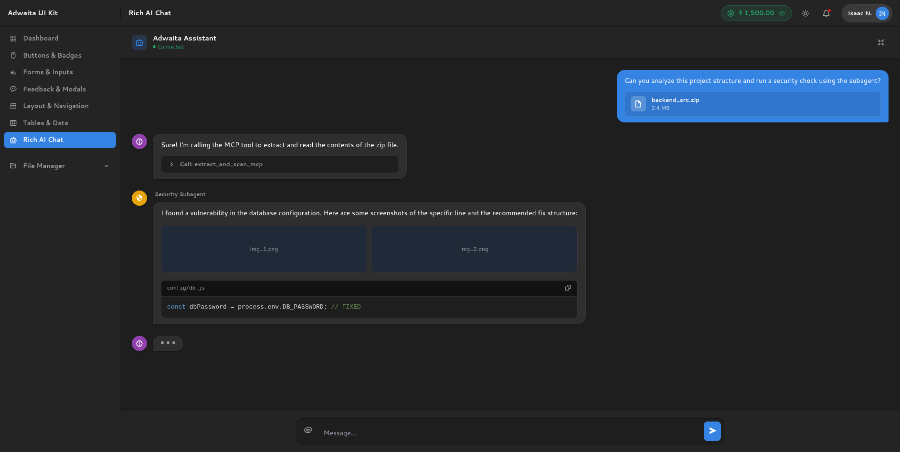

# Adwaita Web UI Kit

A **Gnome Adwaita Web Dashboard** built with Tailwind CSS. This project provides a pixel-perfect web implementation of the GNOME desktop environment design language. If you need a **Gnome Adwaita UI Kit Tailwind** solution, this repository contains all the necessary components.

It includes a complete dashboard layout, a file manager interface (Nautilus-style), an AI chat component, and native dark/light mode toggling. The codebase uses pure HTML, CSS, and vanilla JavaScript, making it easy to integrate into any web framework (React, Vue, Angular, etc.).

## Screenshots

<div align="center">
  
  
  
  
  
  
  
</div>

## Prerequisites
- Node.js

## Getting Started

1. Install the dependencies (Vite and Tailwind CSS):
```bash
npm install
```

2. Start the development server:
```bash
npm run dev
```

3. Open your browser and navigate to the `localhost` URL provided in the terminal.

## Build for Production

To compile the assets for deployment:
```bash
npm run build
```
The compiled static files will be generated in the `dist` folder. You can host this directory on any static web server.

## Project Structure
- `index.html`: The main dashboard file containing all UI components.
- `/src/style.css`: Core Tailwind directives and custom Adwaita CSS variables.
- `tailwind.config.js`: Tailwind configuration, utilizing `darkMode: 'class'` for theme toggling.
